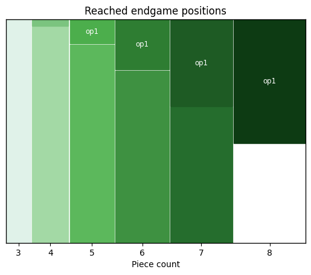

op1
===

Probe Marc Bourzutschky's partial 8-piece tablebase.

The tablebase covers all 8-piece endgames with at least one pair of opposing
pawns on the same file, short *op1*. This accounts for more than half of the
8-piece positions reached in practical play on Lichess.



The provided metric is Depth to Conversion (DTC), the number of moves to
a capture or promotion that retains the game theoretical outcome, ignoring
the 50-move rule.

Download tables
---------------

https://op1.lichess.ovh/tables/

`mbeval-sys`
------------

Low-level tablebase probing library adapted from a debug and research tool, `mbeval.cpp`.

`op1-server`
------------

Provides and HTTP API that can be used directly, or more conveniently via
[`lila-tablebase`](https://github.com/lichess-org/lila-tablebase), where it
provides one of multiple metrics.

### `GET /probe`

```
curl 'https://op1.lichess.ovh/probe?fen=R7/8/8/8/7q/2K1B2p/7P/2Bk4_w_-_-_0_1'
```

```json
{
    "root": 584,
    "children": {
        "e3g5": 0,
        "e3a7": 3,
        "a8c8": 0,
        "c1a3": 0,
        "e3b6": 3,
        "a8a7": 0,
        "e3d2": 4,
        "a8a2": 0,
        "a8f8": -583,
        "c1b2": 3,
        "e3c5": 0,
        "e3h6": 4,
        "e3d4": 6,
        "a8a4": 1,
        "a8b8": 0,
        "c3b3": 0,
        "a8e8": 0,
        "a8a6": 0,
        "e3f2": 1,
        "a8a1": 0,
        "a8h8": 1,
        "c1d2": 6,
        "e3g1": 3,
        "e3f4": 0,
        "a8a3": 0,
        "a8d8": 1,
        "c3b2": 0,
        "c3d3": 6,
        "a8g8": 0,
        "a8a5": 0
    }
}
```

License
-------

The server is licensed under the the GNU Affero General Public License 3.0
(or any later version at your option). See the COPYING file for the full
license text.

`mveval-sys` is derived from `mbeval.cpp`, (c) Marc Bourzutschky, and
may be available under additional licenses.
